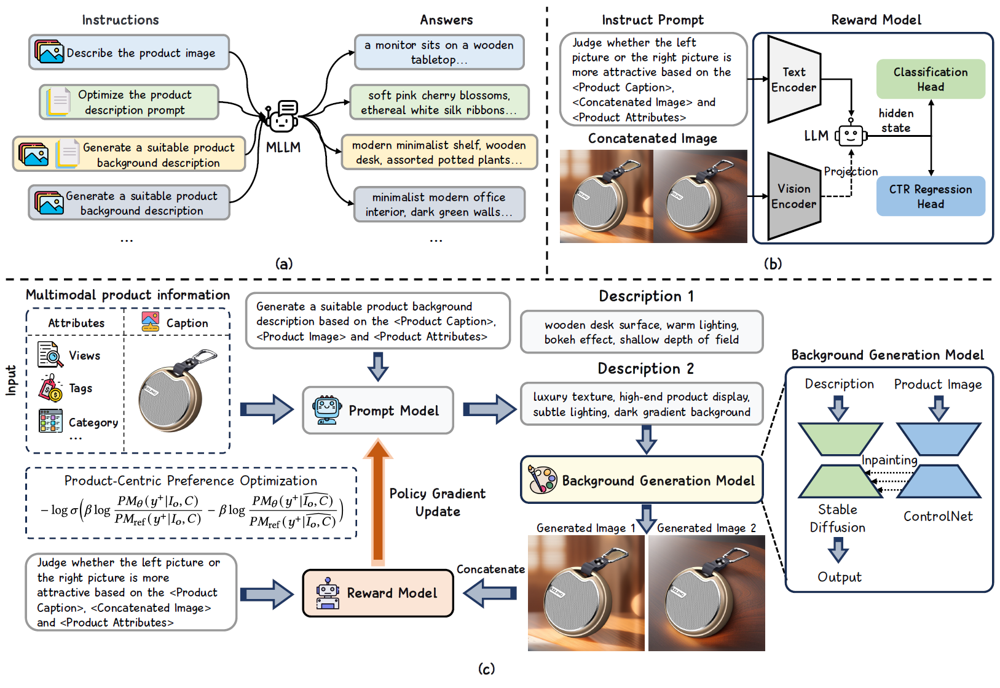

# CTR-Driven Advertising Image Generation with Multimodal Large Language Models

[](https://arxiv.org/abs/2502.06823)

[WWW 2025] Official PyTorch Code for "[CTR-Driven Advertising Image Generation with Multimodal Large Language Models](https://arxiv.org/abs/2502.06823)"
> Xingye Chen, Wei Feng, Zhenbang Du, Weizhen Wang, Yanyin Chen, Haohan Wang, Linkai Liu, Yaoyu Li, Jinyuan Zhao, Yu Li, Zheng Zhang, Jingjing Lv, Junjie Shen, Zhangang Lin, Jingping Shao, Yuanjie Shao, Xinge You, Changxin Gao, Nong Sang <br>
> Huazhong University of Science and Technology, JD.COM  <br>
> WWW 2025 <br>


## Abstract
In web data, advertising images are crucial for capturing user attention and improving advertising effectiveness. Most existing methods generate background for products primarily focus on the aesthetic quality, which may fail to achieve satisfactory online performance. To address this limitation, we explore the use of Multimodal Large Language Models (MLLMs) for generating advertising images by optimizing for Click-Through Rate (CTR) as the primary objective. Firstly, we build targeted pre-training tasks, and leverage a large-scale e-commerce multimodal dataset to equip MLLMs with initial capabilities for advertising image generation tasks. To further improve the CTR of generated images, we propose a novel reward model to fine-tune pre-trained MLLMs through Reinforcement Learning (RL), which can jointly utilize multimodal features and accurately reflect user click preferences. Meanwhile, a product-centric preference optimization strategy is developed to ensure that the generated background content aligns with the product characteristics after fine-tuning, enhancing the overall relevance and effectiveness of the advertising images. Extensive experiments have demonstrated that our method achieves state-of-the-art performance in both online and offline metrics. <br>


 

## 📢 News

`[2025-03-16]:` ✨ Everything’s Here! Pre-training datasets, models, and the full PCPO training code are now available!

`[2025-02-25]:` 🔥 We've released our pre-trained Prompt Model and inference code! Check out the repository for implementation details.

`[2025-02-12]:` 🎯 Our paper is now available on arXiv! Check it out here: [https://arxiv.org/abs/2502.06823](https://arxiv.org/abs/2502.06823).

`[2025-01-20]:` 🎉 Exciting news! Our paper has been accepted to WWW 2025! Stay tuned for more updates!

## 🛠️ Getting Started

- Python >= 3.8 (Recommend to use [Anaconda](https://www.anaconda.com/download/#linux) or [Miniconda](https://docs.conda.io/en/latest/miniconda.html))
- [PyTorch >= 2.3.1+cu11.8](https://pytorch.org/)
```bash
conda create -n caig python==3.8.20
conda activate caig
pip install torch==2.3.1 torchvision==0.18.1 torchaudio==2.3.1 --index-url https://download.pytorch.org/whl/cu118

git clone https://github.com/Chenguoz/CAIG.git
cd CAIG
pip install -r requirements.txt
```

## 🚀 How to inference

Download and extract the pre-trained Prompt Model [[Google Drive](https://drive.google.com/file/d/1OSubzQ55GLQ33OIQRzIx_KiNjO3G0Ozu/view?usp=drive_link)] [[Hugging Face](https://huggingface.co/Chenguoz/CAIG-Prompt-Model-Pre-trained)] and its corresponding vision tower [[download link](https://drive.google.com/file/d/14_ATvmDdAOH8cBUgVCRVRSyyTwaGaIN8/view)]. Then modify the `mm_vision_tower` key in the `config.json` file of the Prompt Model to point to the correct path.

Next, run the following code:
``` bash
bash scripts/gen_demo.sh
```
Please ensure that the Prompt_Model_Path in the `gen_demo.sh` script is set correctly (no need to set other paths, as the remaining models will be downloaded automatically).

## 📊 Datasets
### 1. Dataset for Prompt Model
**Description**: Large-scale e-commerce multimodal dataset for equipping MLLMs with advertising image generation capabilities.
**Access**:  
- [Download Link](http://box.jd.com/sharedInfo/8782F1E0B1CC10684786F0A019A42BD0)
- Access password: `4o69kt`

### 2. Dataset for Reward Model
**Description**: Curated dataset with user interaction signals for click preference modeling.
**Source**:  
- Primary training data: [Tianchi Competition Dataset](https://tianchi.aliyun.com/dataset/93585)
- Complementary test set: [Google Drive](https://drive.google.com/file/d/16lUxOxOH9HCaNOSitXVzTnCrws3-n-4w/view?usp=drive_link)

**Note**: All JD.COM-provided datasets are for academic research only. Commercial use requires explicit authorization.


## Reward Model Evaluation
Download the pre-trained Reward Model from [[Hugging Face](https://huggingface.co/Chenguoz/CAIG-Reward-Model-PublicData-Trained)], **along with the test set mentioned above (no need to download full training set)**. Then modify the `mm_vision_tower` key in the `config.json` file of the Reward Model to point to the correct path.

Next, run the following code:
``` bash
bash scripts/eval_reward_model.sh
```

## Full PCPO Training

**Please ensure that the inference processes for the Prompt Model and Reward Model mentioned above are functioning correctly**, then install the additional libraries required for training with: `pip install -r train_requirements.txt`.

Next, run the following code:
```bash
bash scripts/train_pcpo.sh
```
**Note that there is no need to download any additional datasets**; the code will use the `tiny_dataset` included in the repository to complete the training. Alternatively, you can customize your own dataset according to the `tiny_dataset format` (this is very simple😊).

<!-- ## 🚀 More Code & Weights Notice  
The implementation code and pre-trained weights are currently undergoing JD Open-Source Review Process. We are committed to open-sourcing all materials to support research reproducibility. -->

<!-- ## 📧 Contact for Urgent Requests  
If you require early access for research collaboration or encounter urgent issues, please contact: [chenxingye@hust.edu.cn](mailto:chenxingye@hust.edu.cn) -->

## Citation
If you find our paper or repo helpful for your research, please consider citing our paper and giving this repo a star⭐. Thank you! :)
```
@article{chen2025ctr,
  title={CTR-Driven Advertising Image Generation with Multimodal Large Language Models},
  author={Chen, Xingye and Feng, Wei and Du, Zhenbang and Wang, Weizhen and Chen, Yanyin and Wang, Haohan and Liu, Linkai and Li, Yaoyu and Zhao, Jinyuan and Li, Yu and others},
  journal={arXiv preprint arXiv:2502.06823},
  year={2025}
}
```
## Copyright
The dataset and code in this project are provided by JD.COM and are intended solely for academic research purposes. Any commercial use requires explicit authorization from JD.COM. Unauthorized commercial use of any part of this project is strictly prohibited.
